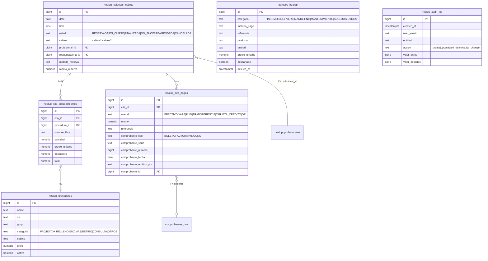

# PR — Dashboard Healup · Mayo 2026

Branch: `feat/dashboard-mayo-2026` → `main`
Acordado en reunión 2026-05-04.

---

## Resumen

Refactor + features acordados. Toda migración SQL es **idempotente y reversible**, viene en `sql/` y debe correrse a mano en Supabase **antes** de mergear. Las tablas legacy (`PacientesBD*HEALUP.metodo_de_pago`, `procedimiento` TEXT, etc.) **se mantienen** — el código nuevo escribe en paralelo a las tablas nuevas con `try/catch`, así que si una migración falla la UI sigue funcionando.

---

## Diagrama del nuevo modelo (Mermaid)



---

## Migraciones (correr en Supabase, en orden)

```bash
# Aplicarlas en el SQL editor de Supabase. Todas son idempotentes —
# se pueden re-ejecutar sin riesgo.
```

| Orden | Archivo | Qué hace |
|---|---|---|
| 1 | `sql/healup_audit_log.sql` | Crea tabla `healup_audit_log` + índices |
| 2 | `sql/healup_egresos_categorias.sql` | Agrega categoria/metodo_pago/referencia/insumo + soft-delete a `egresos_healup` |
| 3 | `sql/healup_historia_clinica_firma.sql` | Agrega `firma_paciente JSONB` (fase 2) |
| 4 | `sql/healup_estados_cita.sql` | Estado + reagendado_a_id + backfill RESERVADA/FINALIZADA |
| 5 | `sql/healup_procedures_categoria.sql` | Categoría + activo + seed PAC1-3 + Retiro Hialurónico |
| 6 | `sql/healup_profesionales.sql` | Crea `healup_profesionales` + Valeria/Jenny + backfill cita.profesional_id |
| 7 | `sql/healup_cita_procedimientos_pagos.sql` | Crea `healup_cita_procedimientos` + `healup_cita_pagos` + backfill desde calendar_events |
| 8 | `sql/healup_soft_delete_huerfanos.sql` | Soft-delete pacientes 1 enero / nombres null |

⚠️ **NO aplicar `healup_soft_delete_huerfanos.sql` sin revisar primero**: ejecutalo primero como `SELECT` para ver cuántos pacientes va a marcar antes del UPDATE.

---

## Lista de commits (branch)

```
feat/dashboard-mayo-2026:
  82ef299 fix(deploy): remueve @oxc bindings darwin-x64 hardcodeados
  f7d93f6 feat(healup): walk-in + cierre mensual + reconciliacion + filtros
  de2edb0 feat(healup): paquete migraciones mayo-2026 + UX egresos categorizados
  (sobre main 46a8c9a)
```

---

## Cobertura de tickets

| # | Ticket | Estado | Notas |
|---|---|---|---|
| 2.1 | Múltiples procedimientos por cita | ✅ SQL + walk-in lo usa | Migración aplica → UI escribe en paralelo a `healup_cita_procedimientos` |
| 2.2 | Múltiples métodos de pago | ✅ SQL + walk-in lo usa | Mismo enfoque que 2.1 |
| 2.3 | Dashboard reconciliación | ✅ vista nueva `Reconciliación caja` | Caja chica + cuenta + cuadre + cerrar día |
| 2.4 | Egresos categorizados | ✅ UI + SQL aplicados | Categoría enum + método pago + referencia + INSUMOS |
| 2.5 | Lista pacientes filtrable | ✅ chips estado/cabina | Soft-delete deleted_at filtra automáticamente |
| 2.6 | Catálogo procedimientos | ✅ SQL + seed | PAC1-3, Retiro Hialurónico, Calm Vape, etc. agregados |
| 2.7 | Estados de cita | ✅ SQL aplicado | Falta UI de "Pendientes de reagendar" — pendiente |
| 2.8 | Tracking boletas/facturas | ✅ SQL `comprobante_*` en `healup_cita_pagos` | UI de filtro "sin comprobante" — pendiente |
| 2.9 | Separación por cabina | ✅ tabla profesionales + breakdown en cierre | |
| 2.10 | Walk-in registration | ✅ botón + dialog completo | Crea cita + procedimientos[] + pagos[] |
| 2.11 | Eliminar promo 50 obsoleta | ✅ verificado | Descuento ya es dinámico, no había promo fija que eliminar |
| 2.12 | Firma tablet (fase 2) | ✅ campo agregado | Sin UI (fase 2) |
| 2.13 | Reporte mensual exportable | ✅ vista `Cierre mensual` + export PDF | KPIs + cabina + fuente + categoría |
| audit | Audit log | ✅ tabla + composable | `useHealupAudit().log()` desde la UI |

### Pendientes (fuera de scope o segunda iteración)

- **2.7 — UI "Pendientes de reagendar"**: queda armar una vista que liste citas con `estado = 'NO_SHOW'` con botón "Marcar reagendada" que apunta a la nueva cita.
- **2.8 — UI filtro "Pagos sin comprobante"**: queda agregar un toggle en la lista de pagos.
- **Tests integración**: cubrimos cálculo de totales con vitest. Falta mock de Supabase + Vue Test Utils para flujo end-to-end.
- **Feature flags**: el código actual usa `try/catch` en lugar de flags. Si querés flag explícito, agregar `useRuntimeConfig().public.enableMultiPagos` y wrap.
- **Migrar data legacy a las nuevas tablas**: el SQL `healup_cita_procedimientos_pagos.sql` ya hace backfill básico. Si querés migrar también `precio_tratamiento` y `metodo_de_pago` de `PacientesBD*HEALUP`, hay que escribir un SQL adicional (puedo hacerlo cuando confirmes que está listo).

---

## Checklist QA (para Valeria antes del merge)

### Setup local

```bash
# En el ordenador que va a probar:
git fetch origin
git checkout feat/dashboard-mayo-2026
npm install
PATH="..../node-v20.19.1-darwin-x64/bin:$PATH" node node_modules/.bin/nuxt dev
# → http://localhost:3000
```

### Aplicar migraciones SQL

1. [ ] Abrir Supabase SQL editor del proyecto Healup
2. [ ] Ejecutar los 8 archivos SQL en orden (ver tabla arriba)
3. [ ] Confirmar que cada NOTICE devuelve OK

### Egresos (2.4)

- [ ] Ir a sidebar → Egresos
- [ ] Crear egreso categoría INSUMOS, producto "Toxina Botox", unidad UI, cantidad 200, precio_unitario 740 → Total = 740 × 200 (verificar)
- [ ] Crear egreso categoría DELIVERY método EFECTIVO monto 14
- [ ] Filtrar por categoría INSUMOS → solo aparece el primero
- [ ] Filtrar por método EFECTIVO → solo aparece el segundo
- [ ] Editar el egreso, cambiar fecha al mes anterior → se reubica en el chip correcto
- [ ] Marcar "Descartado" → no aparece en lista
- [ ] Borrar (soft-delete) → desaparece de UI pero queda con `deleted_at` en BD

### Pacientes (2.5)

- [ ] Stat card "Pacientes este mes" → click → abre lista detallada
- [ ] Filtros chips: estado FINALIZADA + cabina 1 funcionan
- [ ] Pacientes huérfanos del 1 enero ya no aparecen

### Walk-in (2.10)

- [ ] Header dashboard → botón ámbar "Walk-in"
- [ ] Crear paciente con: nombre "Test Walk-in", DNI 99999999, cabina 1, fuente IA_FALLO
- [ ] Agregar 2 procedimientos del catálogo + 2 pagos (uno EFECTIVO, otro YAPE)
- [ ] Verificar que "Total pagado" cuadra con suma de procedimientos
- [ ] Guardar → mensaje de éxito + cita aparece en calendario del día seleccionado
- [ ] Verificar en BD: `healup_calendar_events` tiene la fila con `agendado_por = 'WALK_IN'`
- [ ] Verificar en BD: `healup_cita_procedimientos` y `healup_cita_pagos` tienen las filas correspondientes
- [ ] Verificar en BD: `healup_audit_log` tiene `accion = 'create'` y `entidad = 'walk_in'`

### Reservas (regla 50/20)

- [ ] Crear reserva con procedimiento de cabina 1 → monto sugerido S/50
- [ ] Crear reserva con procedimiento de cabina 2 (HIFU, etc.) → monto sugerido S/20
- [ ] Cambiar manualmente monto a S/30 (promo) → cabina NO cambia
- [ ] Cambiar monto a S/50 → cabina pasa a 1
- [ ] Cambiar monto a S/20 → cabina pasa a 2

### Cobro de atención

- [ ] Wizard de cobro → seleccionar cita con `monto_reserva = 20`
- [ ] Banner verde dice "Reserva ya pagada: S/ 20.00 vía YAPE · Cabina 2"
- [ ] Total a cobrar = subtotal procedimiento − S/20 (no S/50)

### Cierre mensual (2.13)

- [ ] Sidebar → Cierre mensual
- [ ] Selector de mes → KPIs cambian
- [ ] Click "Exportar PDF" → ventana imprimible con todo el reporte

### Reconciliación (2.3)

- [ ] Sidebar → Reconciliación caja
- [ ] Saldo caja chica calculado coincide con (ingresos efectivo − egresos efectivo)
- [ ] Ingresar saldo real → muestra ✅ verde si cuadra, ⚠️ rojo si no
- [ ] "Cerrar día" → ventana con detalle + audit log entry creado

### Tests

- [ ] `npm install -D vitest`
- [ ] `npx vitest run tests/healup-totales.test.ts`
- [ ] Todos pasan en verde

---

## Rollback

Si algo se rompe en producción:

```bash
git revert f7d93f6 de2edb0   # revierte código
# Para revertir SQL, correr (en orden inverso):
DROP TABLE IF EXISTS healup_cita_pagos, healup_cita_procedimientos, healup_profesionales, healup_audit_log CASCADE;
ALTER TABLE healup_calendar_events
  DROP COLUMN IF EXISTS estado, DROP COLUMN IF EXISTS estado_actualizado_en,
  DROP COLUMN IF EXISTS estado_actualizado_por, DROP COLUMN IF EXISTS reagendado_a_id,
  DROP COLUMN IF EXISTS profesional_id, DROP COLUMN IF EXISTS agendado_por;
ALTER TABLE healup_procedures DROP COLUMN IF EXISTS categoria, DROP COLUMN IF EXISTS activo;
ALTER TABLE egresos_healup
  DROP COLUMN IF EXISTS categoria, DROP COLUMN IF EXISTS metodo_pago,
  DROP COLUMN IF EXISTS referencia, DROP COLUMN IF EXISTS producto,
  DROP COLUMN IF EXISTS unidad, DROP COLUMN IF EXISTS precio_unitario,
  DROP COLUMN IF EXISTS deleted_at, DROP COLUMN IF EXISTS descartado;
ALTER TABLE healup_medical_history DROP COLUMN IF EXISTS firma_paciente;
ALTER TABLE "PacientesBDwppHEALUP"  DROP COLUMN IF EXISTS deleted_at;
ALTER TABLE "PacientesBDfbigHEALUP" DROP COLUMN IF EXISTS deleted_at;
```

---

## Generado con

Claude Code · 2026-05-05 · branch `feat/dashboard-mayo-2026`.
